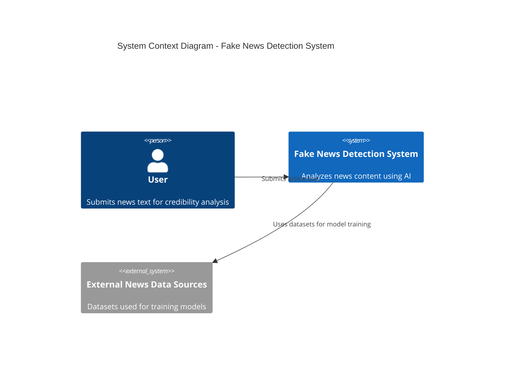
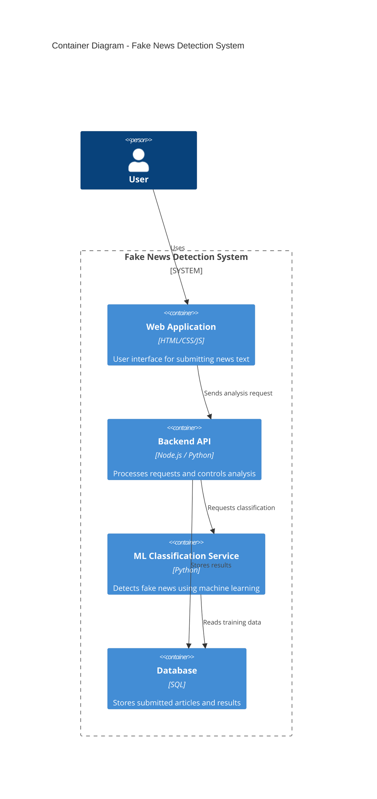
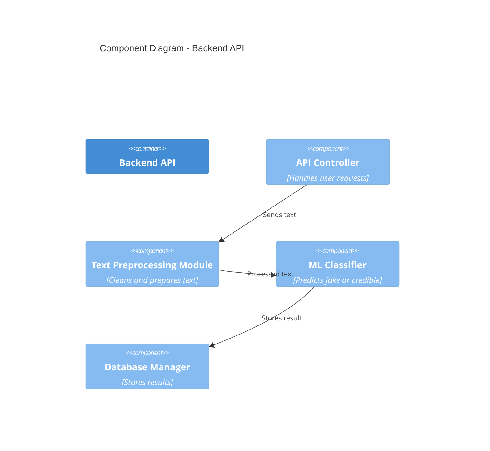

# System Architecture (C4 Model)

## Project Title

AI-Powered Fake News Detection System

## Domain

Digital Media and Journalism

## Problem Statement

Online misinformation spreads rapidly across digital platforms, making it difficult for users to verify the credibility of information. The proposed system provides automated analysis of text content to determine whether it may contain misleading information.

---

# C4 Model Architecture

## Level 1 – System Context Diagram

---

## Level 2 – Container Diagram

---

## Level 3 – Component Diagram

