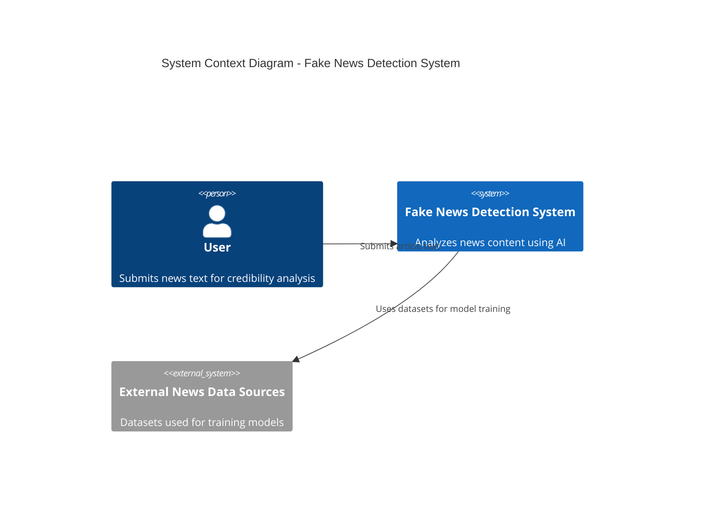

# System Architecture (C4 Model)

## Project Title

AI-Powered Fake News Detection System

## Domain

Digital Media and Journalism

## Problem Statement

Online misinformation spreads rapidly across digital platforms, making it difficult for users to verify the credibility of information. The proposed system provides automated analysis of text content to determine whether it may contain misleading information.

---

# C4 Model Architecture

## Level 1 – System Context Diagram

---

## Level 2 – Container Diagram

The system consists of several containers that work together to perform the analysis.

Containers:

User
→ Web Application (Frontend Interface)

Web Application
→ Backend API Server

Backend API Server
→ Text Processing Module
→ Machine Learning Classification Module
→ Database

Database
→ Stores analyzed articles and results

---

## Level 3 – Component Diagram

Inside the backend server the system includes several components:

API Controller
Handles requests from the frontend interface.

Text Preprocessing Component
Cleans and prepares submitted text for analysis.

Machine Learning Classification Component
Processes text and predicts whether it is credible or misleading.

Result Management Component
Stores analysis results and sends feedback to the user interface.

Database Manager
Handles data storage and retrieval.

