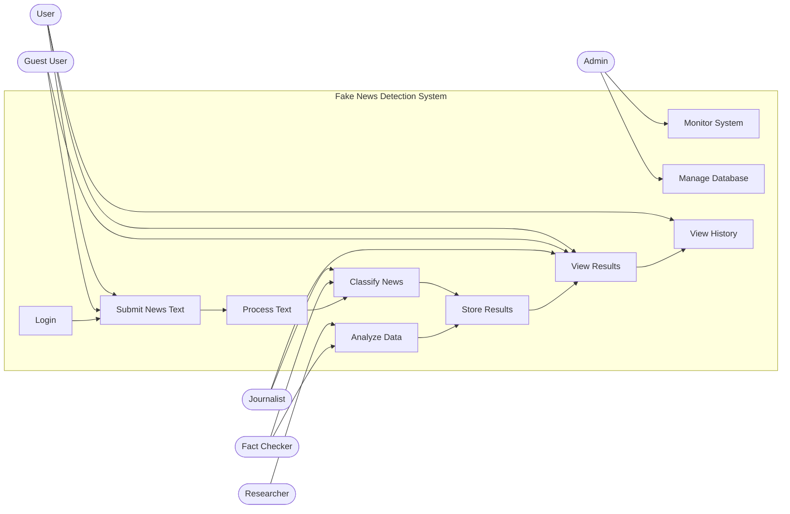

```mermaid
flowchart LR

%% Actors (6+)
User([User])
Journalist([Journalist])
Researcher([Researcher])
Admin([Admin])
FactChecker([Fact Checker])
Guest([Guest User])

%% System Boundary
subgraph System["Fake News Detection System"]

Submit["Submit News Text"]
Process["Process Text"]
Classify["Classify News"]
View["View Results"]
Store["Store Results"]
Analyze["Analyze Data"]
Monitor["Monitor System"]
Manage["Manage Database"]
Login["Login"]
ViewHistory["View History"]

end

%% Actor → Use Cases
User --> Submit
User --> View
User --> ViewHistory

Guest --> Submit
Guest --> View

Journalist --> Classify
Journalist --> View

Researcher --> Analyze

FactChecker --> Classify
FactChecker --> Analyze

Admin --> Monitor
Admin --> Manage

%% Internal Relationships
Submit --> Process
Process --> Classify
Classify --> Store
Store --> View

View --> ViewHistory
Analyze --> Store
Login --> Submit
```

